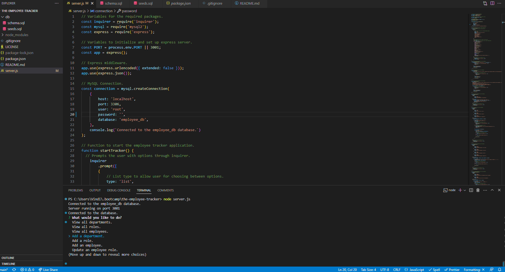

# The-Employee-Tracker

## Description
A simple yet effective database to store employee data for multiple uses! These uses can include departments, job titles, roles, and more associated to that specific employee.  
The employee data will include IDs, first & last names, job titles, departments, role salaries, and managers.  
These will be stored into the database for you to view at any time when necessary. You can also input your own details for testing purposes.  
Give it a try today!  

## Table of Contents
- [Installation](#installation)
- [Usage](#usage)
- [License](#license)
- [Contributing](#contribution)
- [Tests](#tests)
- [Links](#links)
- [Previews](#previews)
- [Credits](#credits)
- [Questions](#questions)
  
## Installation
Follow these instructions:  
1. Git clone this repository.  
2. Install [Node](https://nodejs.org/en).  
3. Install necessary modules by using command: npm install express mysql2 inquirer  
4. Use any git terminal like Git Bash or Visual Studio Code. If you want to start the server locally through a command: node server.js  
  
## Usage
Used for writing and saving employee IDs into a database for multiple uses. The code is used to demonstrate the usage of SQL to create a database.
  
## License
This project is licensed under the MIT license.
  
## Contribution
Please use proper general rules for contribution and merging. Always git pull before you git push your changes. And no merge conflicts please.  
  
## Tests
Use this command to test:  
node server.js  

## Links
**Walkthrough:** [Link to the walkthrough video!](https://drive.google.com/file/d/1ZJUo1B3Wwn-GKLDrFiPXaHkDvxUOvK6G/view)  
**Github Repo:** [Link to Github repository!](https://github.com/Heaveness/The-Employee_Tracker)  

## Previews
Terminal 1:   
Terminal 2:   
Terminal 3:   

## Credits
**Websites:** W3schools, stackoverflow, & reddit  
**Instructor(s):** Ali Maqsood, Daler Singh  
**Assistant Instructor(s):** Shihan, Adam, Krishna, & Tareque Moatar  
**Institution:** University of Toronto  

## Questions
If you have any questions regarding the repo, please contact me at vindictuslbp@gmail.com. Or check with me through my Github profile: [Heaveness](https://github.com/Heaveness).